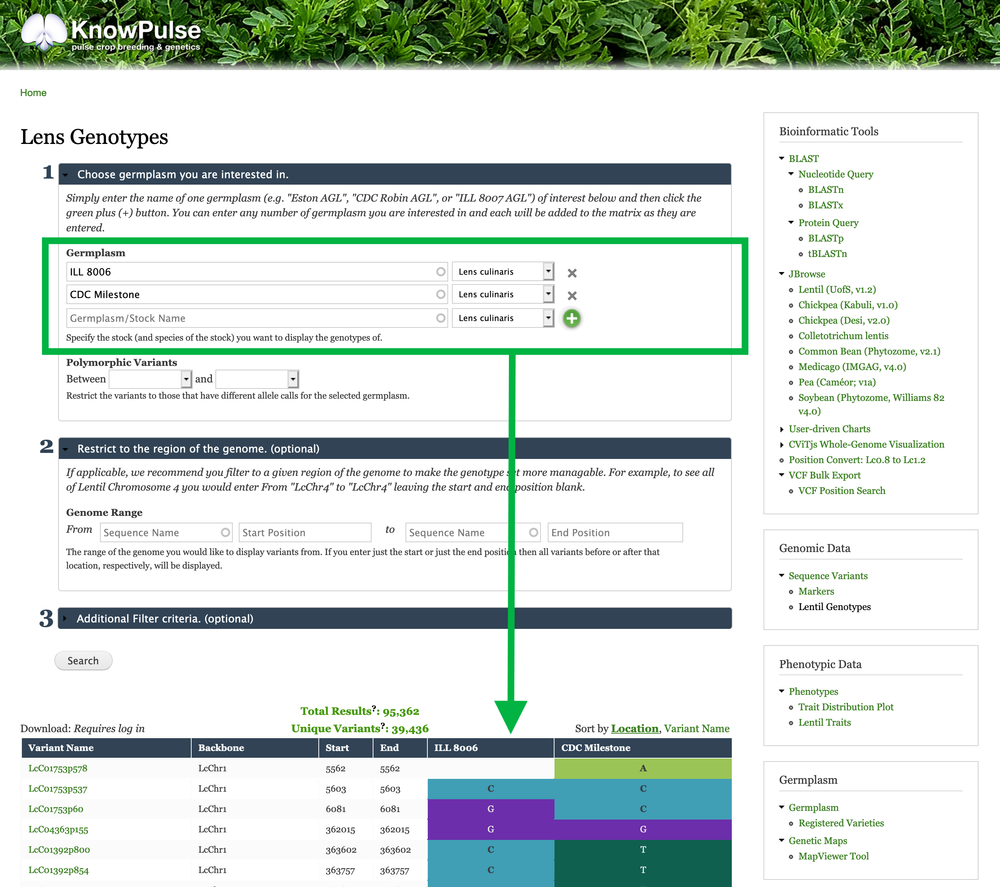
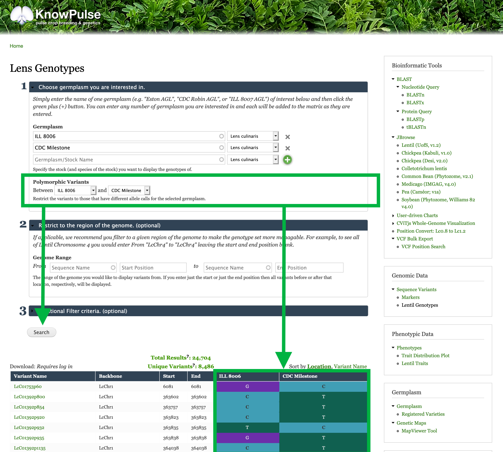
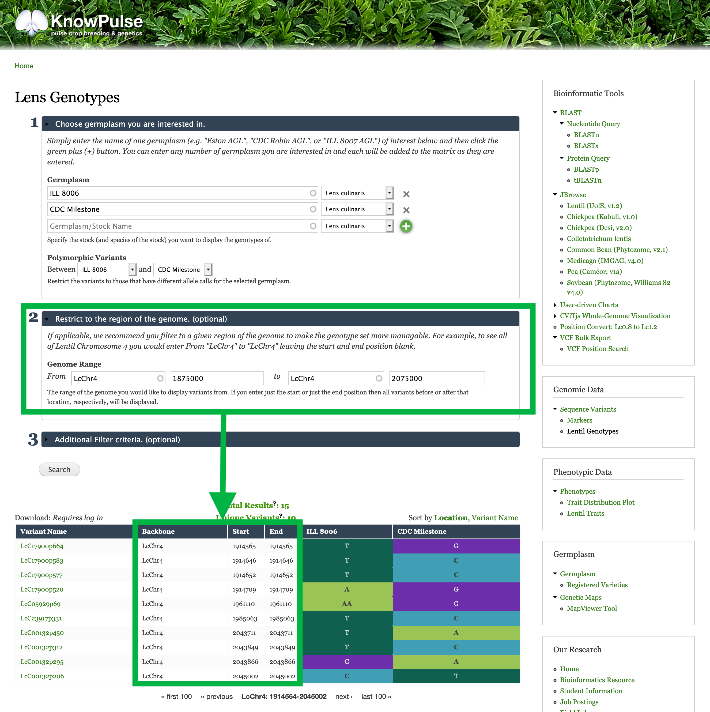
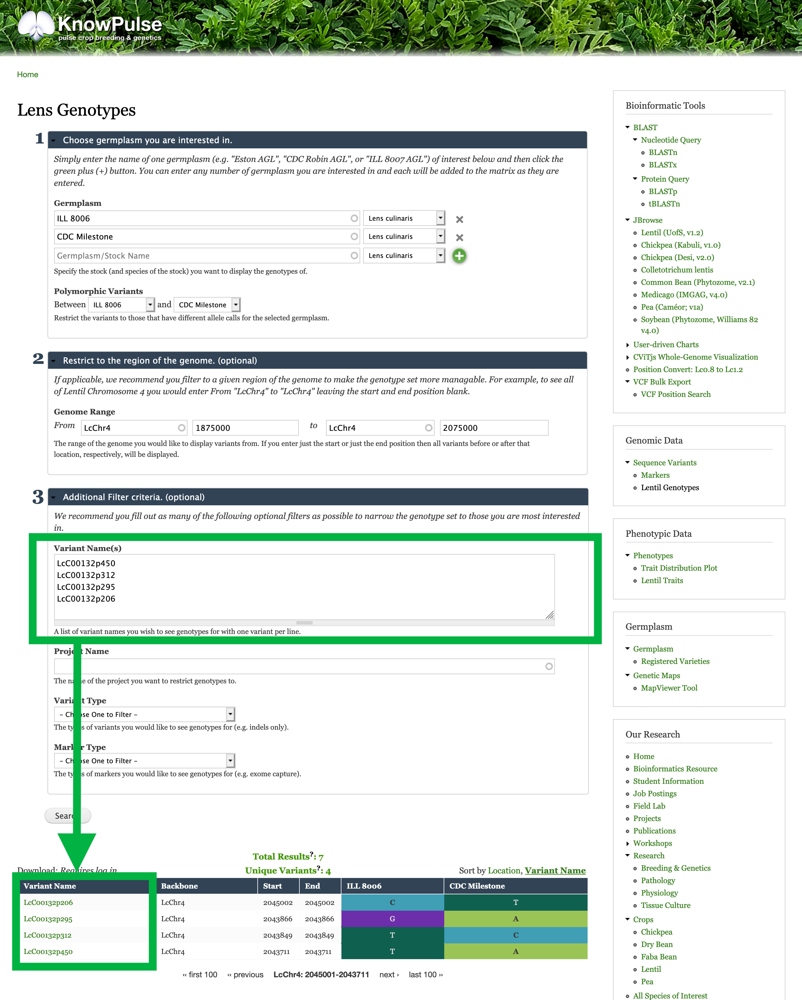

Find a variant in a trait-implicated region
=============================================

**Research Question:**

Through other analysis you have a region of the genome which likely contributes to a specific phenotype for your trait of interest. Now you would like to find a causative or at least correlated sequence variant. For this purpose you know at least two germplasm with differing phenotypes which you have genotypic data available for.

Fictional Example:
 - Trait: ``Flower Colour``
 - Region of interest: ``LcChr4:1875000-2075000``
 - Germplasm with Purple Flowers: ``ILL 8006``
 - Germplasm with White Flowers: ``CDC Milestone``

Step #1: Go to the Lentil Genotype Matrix Tool
------------------------------------------------

 - Go to https://knowpulse.usask.ca
 - Click on "Genotypes" at the top of the page. This will scroll you down to the genotypes section.
 - Click on "Lentil Genotypes" to access the Lentil Genotype Matrix Tool.

 .. image:: gmatrix-poly-region.front.png

Step #2: Find genotypic data for your reference germplasm
-----------------------------------------------------------

 - Enter the name of each germplasm you are interested in by typing it in the textfield labelled germplasm. Then check the correct species is selected to the right of the textbox. To add more then one germplasm click the green + button.

  - For this example, Enter "ILL 8006" in the top germplasm textfield. You will notice that it autocompleted as you type.
  - Then click the green + button and enter "CDC Milestone" in the second textfield which appears.

 - Each time you click the green + button or search, the genotypic data for the listed germplasm will be shown.

Step #3: Restrict the Sequence Variants to polymorphic between your germplasm
------------------------------------------------------------------------------

 - Underneath germplasm, there is a filter to restrict to polymorphic variants. This filter compares two germplasm and only shows variants with different genotypic calls.
 - For our example, we would select ``ILL 8006`` in the first drop down and ``CDC Milestone`` in the second drop-down to see only sequence variants with differing genotypes (i.e polymorphic variants) between these two germplasm.
 - Click Search to see the results.

Step #4: Restrict to you trait-implicated Region of the Genome.
-----------------------------------------------------------------

- The second section of the filter criteria available for the genotype matrix allows you to enter the region of the genome you are interested in. Once you click search, the genotype matrix will only show sequence variants found in this region.
- In our example, the region of interest is non:150-300. To enter this we place ``LcChr4`` for the ``Sequence Name``, ``1875000`` for the start position and ``2075000`` for the end position.

Step #5: (Optionally): Restrict to specific variants.
------------------------------------------------------

- Say further analysis shows that particular sequence variants in that region are more likely to contribute to your phenotype of interest.
- You can enter the specific variant names by expanding the ``Additional Filter criteria`` section then clicking Search.

